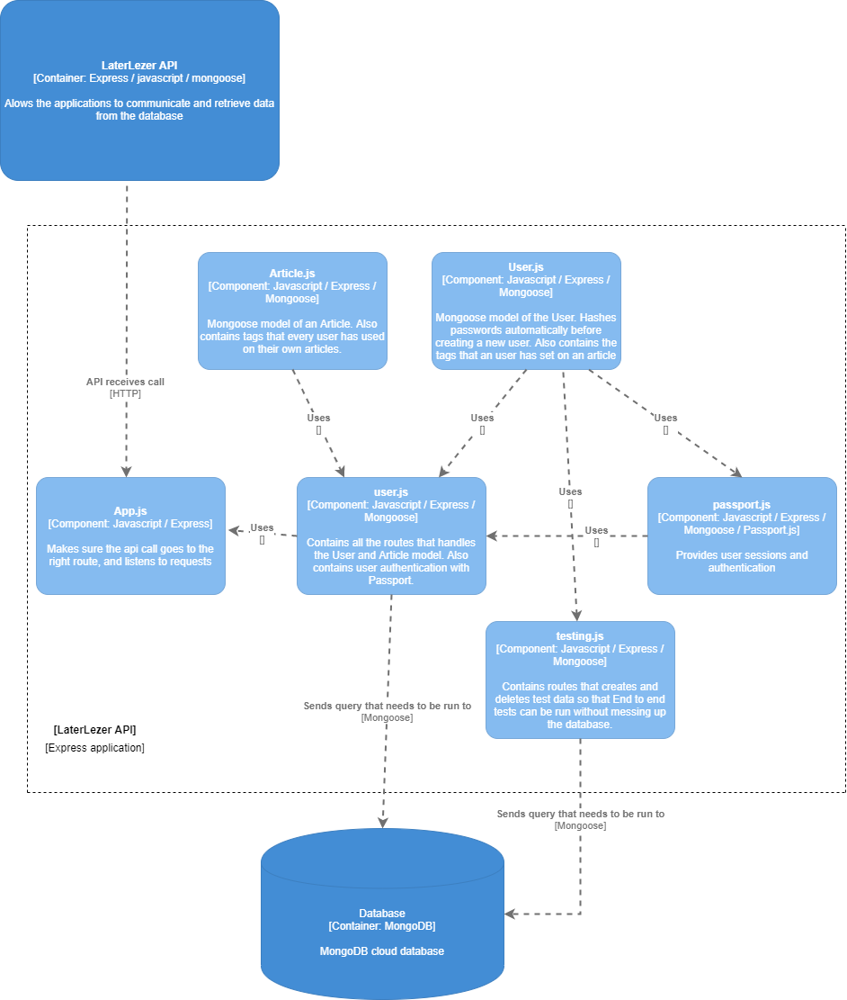

# Software Guidebook

Aangezien het lezen van de code van de LaterLezer niet het hele verhaal verteld en de redenatie achter het design van LaterLezen niet in code te beschrijven is, is ervoor gekozen om een software guidebook te schrijven. Dit maakt het gemakkelijk voor de programmeurs die verder willen bouwen op de bestaande applicatie. In dit software guidebook staat dan ook beschreven hoe de LaterLezer applicatie in elkaar steekt. 

## Table of Contents
[TOC]


## Context

De opdrachtgever is als onderzoeker bij ons langsgekomen met de vraag of wij een reader-app voor hem willen ontwikkelen. De bestaande reader-apps voldoen niet aan de eisen die hij stelt. Hij denkt dat het waard is om een nieuwe reader-app te laten maken die wel aan zijn eisen voldoen. De eisen zijn beschreven in de hoofdstuk Functioneel Overzicht. Deze reader-app is bedoeld om hem en andere onderzoekers te ondersteunen met het opslaan van wetenschappelijke artikelen zodat zij deze later kunnen lezen.

Met deze reader-app hoopt de opdrachtgever dat deze app wel aan zijn eisen voldoet, en dat andere onderzoekers naar deze reader-app overstappen. Dit betekent dat de Laterlezer een concurrent wordt voor de andere reader-apps, zoals Instapaper, Raindrop, Pocket.io, etc. De oprachtgever heeft als doel om een reader-app te ontwikkelen die meer gebruikersvriendelijk is voor lezers die frequent (wetenschappelijke) artikelen opslaan, dus Laterlezer is bedoeld voor een ander doelgroep dan de hiervoor genoemde reader-apps.

## Functioneel Overzicht

De Laterlezer app bestaat uit een mobiele webapplicatie waarin de gebruiker zijn artikelen op kan slaan en kan lezen. Daarnaast bestaat Laterlezer uit een extensie, waarmee gebruikers artikelen snel op kan slaan op een andere website.

De Laterlezer app slaat (wetenschappelijke) artikelen op die vanuit andere websites zijn gehaald. Elk artikel heeft een URL waarvan de artikel vandaan komt, en optioneel een aantal tags om het artikel snel terug te vinden m.b.v. het filtersysteem voor tags. Bij het lezen van een artikel kan de gebruiker een aantal functies gebruiken om het lezen makkelijker te maken, bijvoorbeeld het groter maken van tekst, of het veranderen van de achtergrond kleur. Om een artikel bij een gebruiker, moet deze natuurlijk ook kunnen registreren en inloggen. 

Zonder deze basisfunctionaliteit kan de applicatie niet werken. Het is van belang dat deze functies als eerst zijn uitgevoerd voordat we verder kunnen met de extra functies. De opdrachtgever wilt dat wij een aantal extra functionaliteiten implementeren zodat de app daadwerkelijk zijn eigen functies heeft. Deze functionaliteiten zijn als volgt:

- Pay-walls omzeilen
- Hiërarchische tags
- Opslaan van PDF's
- Metadata ophalen
- Importeer data van andere reader-apps
- Ondersteuning grotere teksten

Voor meer verduidelijking over deze functionaliteiten wordt het Plan van Aanpak geraadpleegd. Welke functionaliteiten wij implementeren, hangt af van wat de opdrachtgever wilt en hoeveel tijd wij ervoor nodig hebben om dat te realiseren. 

Met deze extra functionaliteiten hopen wij onze doelgroep, de onderzoekers, tevreden zijn met onze reader-app, en hierdoor artikelen makkelijker kunnen opslaan en lezen vergeleken met de andere reader-apps.

## Kwaliteitsattributen
Natuurlijk zijn er tijdens de ontwikkeling van een app ook niet functionele eisen, deze worden ook wel de kwaliteitsattributen genoemd. Om te zorgen dat onze reader-app in de toekomst nog steeds onderhoudbaar blijft, moet de app voldoen aan een aantal kwaliteitsattributen. Deze attributen zijn als volgt:

- Prestatie: om de app te laten draaien moeten de servers van de app voortdurend online zijn. Hierdoor kunnen gebruikers altijd nieuwe artikelen opslaan en hun eigen artikelen ophalen. 

- Beveiliging: natuurlijk moeten de gegevens van de gebruiker beveiligd zijn opgeslagen in de database van de app. Daarom versleutelen we gegevens zoals de wachtwoorden, als er toch ooit iemand onbevoegd toegang krijgt tot de database, kunnen ze niet bij de daadwerkelijke wachtwoorden van onze gebruikers komen.

  Daarnaast willen wij ten alle koste inbraken zoals SQL Injectie voorkomen, dit doen we door middel van meerdere RegEx controles uitvoeren voordat de invoer verstuurd naar de server. Behalve de Front-end bevat de Back-end ook een aantal controles.

- Compatibiliteit: de LaterLezer app wordt uiteindelijk ook een web-extensie. Daarom moet deze extensie beschikbaar zijn voor alle browsers. Hiernaast willen wij het ook mogelijk maken dat alle artikelen toegevoegd kunnen worden bij onze app.

- Gebruikersvriendelijkheid: om alle gebruikers tevreden te houden moet de app gebruikersvriendelijk zijn. Dit doen met een menu waarin je jouw voorkeur kan aangeven tijdens het lezen van een artikel. Denk hierbij aan de achtergrond kleur, het lettertype en lettergrootte. Daarnaast zullen de gebruikers een mogelijkheid hebben om een van de vaste thema's te kiezen die LaterLezen aanbied.
- Efficiëntie: natuurlijk wilt een gebruiker niet teveel tijd en moeite insteken tijdens het toevoegen van een artikel. Daarom houdt LaterLezen het erg compact en makkelijk. De gebruiker hoeft eenvoudig een URL van het artikel in te voeren en eventueel een of meerdere tags.

Aan de hand van deze kwaliteitsattributen hoopt de opdrachtgever een reader-app te kunnen ontwikkelen die uitstraalt vergeleken met de andere reader-apps

## Beperkingen

Tijdens het ontwikkelen van de app zijn er een aantal beperkingen, deze beperkingen worden hieronder genoemd:

- Het team heeft 3 sprints om aan Laterlezer te werken. (1 sprint is 2 weken)
- Het team bestaat uit 5 man.
- Ieder teamlid werkt tijdens het project ook aan zijn leerdoelen.
- Het team ontwikkelt de app d.m.v. Node, Express, MongoDB/Mongoose en React omdat het team daarmee de meeste kennis heeft.
- Het team maakt gebruik van onbekende technieken, zoals ontwikkeling van extensies en login met oAuth
- De server stuurt en ontvangt berichten van de client in de vorm van JSON

Een beperkingen hoeft niet altijd meteen negatief te zijn, kijk hierbij naar de grootte van ons team, met een klein groepje van 5 is het makkelijker om samen te werken en het overzicht van het gehele team te behouden. Ook is het hierdoor simpeler om gebruik te maken van elkaars sterke punten.


## Principes
Wij hebben op dit moment niet over bepaalde principes nagedacht tijdens het ontwerpen en het bouwen van de Laterlezer app.

## Software-architectuur
Door het lezen van dit hoofdstuk krijg je een beter beeld van hoe de structuur van de software eruit ziet. Deze schetsen zijn gebaseerd op het C4 model.

1. The big picture (system context)

    Dit is het beginpunt van onze applicatie, hierbij wordt de interactie tussen de gebruiker en de reader-app weergeven.

    

    

    

2. Container view

    Dit is een verdiepende schets van wat er nou precies afspeelt wanneer de gebruiker een actie uitvoert.

    

    

    

3. Component views

    Hierna kunnen we vergroten tot de component view per container. Deze worden opgedeeld in de API component, app component en extension component.

    ### API component view
    

    De API zorgt voor de communicatie tussen de gebruiker en de database. Zodra de API een request ontvangt van de gebruiker, kijkt de API naar de relevante route die de request afhandelt. Dit hangt af van wat welke route de gebruiker aanroept en de type request die de gebruiker meegeeft. Op dit moment ondersteunt de API alleen GET, POST, PUT en DELETE requests naar de routes die behoren tot users en artikelen. De API zorgt ervoor dat de gebruiker waarvan de API call afkomstig is eerst geverifieerd wordt. Pas wanneer gebleken is dat dit een geldige gebruiker is, laat de API informatie los. De informatie die de API terug geeft, is alleen informatie van de gebruiker waarvan de call afkomstig is. Er is geen manier vor gebruikers om een API call te doen naar informatie van een andere gebruiker zonder ingelogd te zijn op het account van desbetreffende gebruiker.

    Een gebruiker bestaat uit de volgende velden:
    ```
    - email. Het mailadres van de gebruiker om elk gebruiker te identificeren
    - firstname. De voornaam van de gebruiker
    - lastname. De achternaam van de gebruiker
    - password. De wachtwoord die de gebruiker heeft ingesteld, gehashed met bCrypt. Dit is de sleutel van een account van elk gebruiker
    - createdAt. De datum waarin de gebruiker is aangemaakt
    - articles. Alle artikelen die door de gebruiker is opgeslagen
    - tags. Alle hoofd en sub tags die de gebruiker opslaat bij zijn artikelen
    - preferences. De thema die de gebruiker heeft geselecteerd om de artikel te lezen.
    ```

    Een artikel bestaat uit de volgende velden:
    ```
    - url. De link van een artikel waar de gebruiker het artikel vandaan heeft gehaald
    - title. De titel van een artikel
    - excerpt. Een korte beschrijving van een artikel
    - lead_image_url. De thumbnail die de artikel heeft gebruikt
    - content. De hele tekst van de artikel
    - author. De auteur die het artikel heeft geschreven
    - domain. De website waar de artikel vandaan komt
    - date_published. De datum wanneer het artikel is gepubliceerd
    - word_count. Het aantal woorden in de artikel. Telt de hele content mee.
    - tags. De gebruiker kan tags toewijzen aan een artikel om het artikel makkelijker terug te vinden. Ondersteunt hierarchisch structuur met parent tags en children tags.
    - read. Status of de gebruiker een artikel heeft gelezen
    - createdAt. De tijdstip waneer de auteur een artikel heeft opgeslagen
    ```

    

    ### Extension view
    

    De webextensie is het meest simpele component van dit project. Op het moment dat je de laterlezer extensie opent, komt er een login scherm tevoorschijn. Hierop is het de bedoeling dat de gebruiker inlogt, om de functionaliteit om een artikel op te slaan te gebruiken. Het login scherm laat ook foutmeldingen zien van een foute inlogpoging.

    Als de gebruiker succesvol is ingelogd komt het article component naar voren. Hierin kan de gebruiker een url invoeren van een artikel die hij/zij wilt opslaan. Daarnaast is er de mogelijkheid om de titel van het artikel te bepalen. Als deze niet wordt ingevuld, pakken we de titel die de artikel/mercury parser ons geeft. daarnaast is het ook mogelijk om tags toe te voegen aan de artikel. Deze staan klaar om geselecteerd te worden.

    Om gebruik te maken van de database vanuit de applicatie, moet er gecommuniceerd worden met de API. De api is een programmeer interface waar je verzoeken aan kan maken. Bij de extensie zijn dit er echter maar 2. Het eerste verzoek is om de gebruiker in te loggen. Het login en de article component maken gebruik van een serverCommunication helper bestand. Hierin staan alle verzoeken die je kan doen aan de API vanuit de webextensie. Als het verzoek aan de API wordt gedaan om in te loggen, communiceert de API met de database. In de database wordt gecontroleerd of er een gebruiker bestaat met de credentials die megegeven staan. Als dit wel of niet zo is geeft de database dit terug aan de api, en de api terug aan het login component.

    Voor het opslaan van een artikel maken we ook gebruik van het serverCommunication helper bestand. Hierin staat de route die nodig is om een verzoek te doen aan de API om een artikel toe te voegen aan de database. Dit verzoek gaat aan de hand van de velden die meegegeven zijn wel of niet goed. Als deze wel goed gaat dan wordt de artikel in de database opgeslagen. Zo niet, dan krijgt de user een notificatie dat er wat mis ging.

    ### Database view
    

    ### LaterLezer web app component
    

    De App bevat bijna alle componenten in de webapplicatie. De app laadt componenten in op basis van waar de gebruiker zich plaatsvindt in de website. Alle componenten die requests naar de API uitvoert, maakt gebruik van Servercommunication, een aparte bestand in de webapplicatie die niet afhankelijk is van App. Servercommunication bevat alle fetch requests die de componenten nodig hebben om met de API te communiceren. Een component haalt de data via de API als volgt op: Eerst roept de component een functie binnen Servercommunication aan om een fetch request te sturen. De request hangt uiteraard af vanuit welk component, en kan bestaan uit een GET, POST, PUT of een DELETE request. Na het aanroepen van deze functie, communiceert de webapplicatie met de API om de request af te handelen. Zodra de API de request heeft afgehandeld, stuurt de API een bericht terug naar de functie binnen Servercommunication waar de request vandaan komt. De component die de fetch functie aanroept, handelt het bericht van de API af. Wat er na het ontvangen van dat bericht gebeurt, hangt af van hoe dat in een component geimplementeerd is.

    ### LaterLezer app - user flow
    

    #### **Homepagina**
    De gebruiker komt voor het eerst op de homepagina van de website. De gebruiker kan ervoor kiezen om te registreren, waarin hij in de registratiepagina komt, of om in te loggen. De gebruiker komt dan op de pagina waarin hij kan inloggen. 

    #### **Registratie**
    De gebruiker zal als eerst registreren op de website, omdat de gebruiker geen account heeft. Nadat de gebruiker de registratieformulier heeft ingevuld, stuurt het registersysteem een functie aan van servercommunication. Servercommunication voert dan de functie aan die het registersysteem aanroept, en doet een fetch request naar de API toe. Voor het registersysteem is het een POST request naar de user route in de API. De API handelt het verzoek in de relevante route af. Eerst controleert de API of de email formaat correct is en of de wachtwoord lang genoeg is. Daarna voegt de API na het hashen van de wachtwoord de gebruiker in de database toe. De API stuurt een bericht terug naar de web applicatie. Het registersysteem vangt dit keer het bericht op, en verstuurt de gebruiker naar de dashboard.

    #### **Artikel opslaan**
    De gebruiker bevindt zich nu in de dashboard. De gebruiker kan nu alleen een artikel opslaan, omdat de gebruiker voor het eerst op de dashboard komt. De gebruiker navigeert naar de save article pagina. Daarin geeft de gebruiker de URL van de artikel mee om een artikel op te slaan. Optioneel kan de gebruiker ook een titel meegeven, die dan de originele titel van de artikel overschrijft. De gebruiker kan ook tags meegeven, zodat de gebruiker de artikel makkelijker terug kan vinden op de search article component. Zodra de gebruiker de artikel opslaat, stuurt de save article component een functie aan van Servercommunication, die vervolgens een fetch request doet naar de API. De API gaat naar de route toe die de fetch request heeft aangegeven, en handelt het verzoek om een article op te slaan daarin af. Na het afhandelen van het verzoek stuurt de API een bericht terug naar de Save article component om te laten weten dat het opslaan van de artikel is gelukt, of gefaald is. De save article component redirect de gebruiker niet naar een ander pagina.

    #### **Dashboard**
    Nu kan de gebruiker kiezen om terug te gaan naar de dashboard, om een artikel te zoeken, of om nog een artikel op te slaan door het hierboven beschreven proces opnieuw te herhalen. Als de gebruiker de opgeslagen artikel wilt lezen, navigeert de gebruiker terug naar de dashboard. De dashboard laat nu de opgeslagen artikel zien. De gebruiker kan de artikel lezen door op de titel, afbeelding of de "Read article" knop aan te klikken. 
    
    #### **Artikel lezen en thema veranderen**
    De gebruiker komt nu bij de Display article component. Daarin kan de gebruiker de gekozen artikel doorlezen. Als eerst roept display article de functie via servercommunication aan om de huidige geselecteerde thema op te halen. Bij een nieuw gebruiker is de thema altijd 'White'. De display article component zet na het ophalen van de kleur de thema in. De gebruiker kan in de component een nieuw thema selecteren. Als een gebruiker een thema selecteert, dan kan de gebruiker de geselecteerde thema bekijken. De gebruiker kan ervoor kiezen om de thema op te slaan, een ander thema te selecteren, of het kiezen van een thema te annuleren. Bij het selecteren van een thema doet de display article component nog geen verzoek naar de API. Op het moment dat de gebruiker niet zijn thema wilt wijzigen door op annuleren te klikken, of buiten de themaopties menu te klikken, doet de display article component nog een request naar de API om de huidige opgeslagen kleur op te halen, en deze opnieuw in te stellen aan de component. Als de gebruiker een nieuw thema selecteert en opslaat door op opslaan te klikken, dan roept de display article component een functie in servercommunication aan, die vervolgens de fetch request naar de API doet om de nieuwe kleur te zetten. Zodra de API een bericht terug stuurt naar de display article component, stelt dit component het nieuwe thema in, zodat de gebruiker een nieuwe thema krijgt om de artikel te lezen.

    Naast het instellen van de thema kan de gebruiker ook naar de pagina van de originele artikel navigeren waar de gebruiker de artikel vandaan heeft gehaald. Er is op dat moment naast de vorige knop in de browser of het handmatig invoeren van de website URL geen manier om terug te gaan naar de display artikel component.

   #### **Artikel meta data bewerken**
    Bij het component: Display article kan de gebruiker de meta data van een artikel bewerken. Op deze manier kan een gebruiker een artikel lezen en meta data velden aanpassen. Onderaan de pagina staat een button met een pen icoontje. Op het moment dat er op die button geklikt wordt, staat het artikel in bewerk modus. Het artikel kan in deze modus nog steeds gelezen worden, maar de meta data bovenaan de pagina worden input velden. In het geval dat de bewerk modus actief is, verschijnen er twee buttons onderaan de pagina, namelijk: Opslaan en Annuleren. In de bewerk modus kunnen de volgende velden aangepast worden: Titel, Auteur, Bron en Descriptie. Aanpassingen kunnen ongedaan gemaakt worden in het geval deze nog niet opgeslagen zijn. Aanpassingen kunnen ook opgeslagen worden door op de button onderaan de pagina te klikken. De volgende velden kunnen leeg gelaten worden bij het bewerken: Auteur, Bron en Descriptie. De titel van een artikel kan niet leeg gelaten worden, en zal een foutmelding geven aan de gebruiker in het geval dit toch gebeurt. 

    #### **Overzicht artikel zoeken**
    De gebruiker kan na het lezen van de artikel ervoor kiezen om terug naar de dashboard te gaan, een nieuw artikel op te slaan, of het zoeken van opgeslagen artikelen. Als de gebruiker zijn artikelen wilt zoeken, navigeert de gebruiker naar het Search article component. In het Search article component heeft de gebruiker de optie om opgeslagen artikelen op tags te zoeken. Daarnaast heeft de gebruiker de optie om op verschillende meta data te zoeken namelijk: titel, auteur,descriptie,bron en content. 
    
    #### **Zoeken op tags**
    Wanneer de gebruiker artikelen wilt filteren op basis van tags, kan hij naar de Search Article component gaan.  Hierbij worden alle gebruikte tags van de user op een hiërarchische structuur teruggegeven. De gebruiker kan nu een tag selecteren doormiddel van een checkbox aan te klikken. Daarna kan de gebruiker nog meer sub-tags aanvinken die nu worden weergeven op basis van de main-tag die aangeklikt was. Als de gebruiker zijn/haar gewenste tags heeft geselecteerd kan hij op de 'Search' knop klikken en wordt er een functie aangeroepen naar de Servercommunication met de geselecteerde tags in een String Array. Deze servercommunication zal dan een fetch request maken en geeft de artikelen terug die aan de geselecteerde tags voldoen. De artikelen worden daarna in een overzichtelijke lijst weergegeven op de pagina. Naast de 'Search' knop bestaat er ook een 'Clear tags' knop die de geselecteerde tags snel verwijderd.

    
   #### **Zoeken op verschillende meta data**
   Als de gebruiker ervoor kiest om een artikel te zoeken op basis van: auteursnaam,titel,descriptie of bron, dan haalt het search article component alle artikelen op die voldoen aan de ingegeven zoekterm. Er is ook een optie om te zoeken op basis van content door te klikken op de checkbox: "Enable search by content". Als dit aangevinkt wordt is het mogelijk om te zoeken op teksten uit het artikel. De API ondersteunt ook de mogelijkheid om op een gedeelte van de auteursnaam,titel,descriptie, bron te zoeken. Na het invullen van de gewenste zoekterm, zoekt de API op artikelen die voldoen aan de gegeven zoekterm. De search article component roept de functie in Servercommunication aan, die vervolgens een fetch request naar de API doet om de juiste artikelen op te halen. Na het verzoek van de search article component, krijgt dit component de relevante artikelen terug van de API. De resultaten worden overzichtelijk getoond in een lijstweergave met kaarten.


## Infrastructuur-architectuur
Op dit moment draait het Laterlezer project alleen in de lokale pc van de teamleden. Laterlezer gebruikt op dit moment de [online Mongo database](https://www.mongodb.com/) om alle gegevens op te slaan. Zo werken alle teamleden met hetzelfde gegevens. Dit helpt voornamelijk met debuggen. Na het overdragen van Laterlezer kan de opdrachtgever ervoor kiezen om de Mongo database te draaien op een lokale server.

Elk gebruiker kan met elk apparaat verbinding met de Laterlezer API maken zolang er internet verbinding beschikbaar is die het verzenden en ontvangen van JSON berichten ondersteund. Alle requests van de gebruikers gaan via HTTP requests naar de API. De API handelt alle data die bij de gebruiker hoort zolang de gebruiker erom vraagt.


## Deployment
Om LaterLezen te kunnen draain in een testomgeving zijn er een aantal dingen nodig. Zo moet er een database draaien op Atlas Mongo. Hier kan je een gratis test database online laten draaien. Verder moet de frontend op port 3000 gedraaid worden en de backend op port 4000. De extensie moet gebuild worden en vervolgens in de development extensies van chrome geladen worden.

Voor de backend zijn de volgende dependencies nodig voor het succesvol draaien en testen van de applicatie:

- @postlight/mercury-parser: ^2.2.0
- article-parser: ^4.2.5
- bcrypt: ^5.0.0
- connect-mongo: ^3.2.0
- cookie-parser: ^1.4.5
- cors: ^2.8.5
- dotenv: ^8.2.0
- express: ^4.17.1
- express-session: ^1.17.1
- jsdom: ^16.4.0
- jsonwebtoken: ^8.5.1
- moment: ^2.29.1
- mongoose: ^5.10.13
- morgan: ^1.10.0
- node-fetch: ^2.6.1
- passport: ^0.4.1
- passport-jwt: ^4.0.0
- passport-local: ^1.0.0
- puppeteer: ^5.5.0
- puppeteer-autoscroll-down: ^0.1.6

Voor de frontend zijn de volgende dependencies nodig voor het succesvol draaien en testen van de applicatie:

- @testing-library/jest-dom: ^5.11.5
- @testing-library/react: ^11.1.2
- @testing-library/user-event: ^12.2.2
- article-parser: ^4.2.5
- axios: ^0.21.0
- fs: 0.0.1-security
- html-react-parser: ^0.14.2
- materialize-css: ^1.0.0
- react: ^17.0.1
- react-dom: ^17.0.1
- react-materialize: ^3.9.3
- react-router-dom: ^5.2.0
- react-scripts: ^4.0.0
- web-vitals: ^0.2.4

Voor de extensie zijn de volgende dependencies nodig voor het succesvol draaien van de applicatie:

- @testing-library/jest-dom: ^5.11.6-
- @testing-library/react: ^11.2.1-
- @testing-library/user-event: ^12.2.2-
- materialize-css: ^1.0.0-rc.2-
- react: ^17.0.1-
- react-dom: ^17.0.1-
- react-scripts: 4.0.0-
- web-vitals: ^0.2.4


## Werking en ondersteuning
Om alle onderdelen van Laterlezer te installeren, heeft Laterlezer de volgende vereisten:
- Git, om het project binnen te halen
- Node, om alle onderdelen van de applicatie te installeren

Om dit project op te halen, navigeer naar de map waarin het project wordt opgeslagen.

Open vervolgens de terminal en voer uit:
```git
git clone https://github.com/HANICA-DWA/sep2020-project-pardellos.git
```

Zodra het project is opgehaald, is het mogelijk om de onderdelen van Laterlezer te installeren.

### Front-end webapplicatie
Vereisten:
- React

Navigeer naar
```
sep2020-project-pardellos \ LaterLezen \ Front-end
```

Open de terminal en voer de installatie uit door het volgende in te voeren:
```node
npm install
```
Voer na de installatie het volgende uit:
```node
npm start
```

De webapplicatie draait, maar geeft een foutmelding terug dat 'M' niet gedefineerd is. Open index.js, en sla dit bestand op zonder wijzigingen aan te brengen. De webapplicatie laat nu de homepagina zien. De webapplicatie kan data opvragen van de server zolang de server draait. Na elke wijziging ververst de webapplicatie zichzelf, waardoor alle wijzigingen meteen zichtbaar zijn. 

### Back-end server

Vereisten:
- Express
- MongoDB 

Navigeer naar
```
sep2020-project-pardellos \ LaterLezen \ Back-end
```

Open de terminal en voer de installatie uit door het volgende in te voeren:
```node
npm install
```

Voer na de installatie het volgende uit:
```node
npm run dev
```

De server staat nu aan. De server accepteert requests van de webapplicatie zolang de server de request ondersteund, en de verbinding naar de mongo database correct is meegegeven. Stel de database connectie in de MONGO_URI in binnen het config.env bestand, te vinden in:
```
Back-end \ config \ config.env
```

Na elke wijziging ververst de server zichzelf, waardoor alle wijzigingen meteen zichtbaar zijn. 


### Extensie

Vereisten:
- React
- Google chrome

Navigeer naar
```
sep2020-project-pardellos \ LaterLezen \ laterlezer-extension
```

Open de terminal en voer de installatie uit door het volgende in te voeren:
```node
npm install
```

Voer na de installatie het volgende uit:
```node
npm run build
```

Na het uitvoeren van dit commando komt de map build in het project.
Open nu de chrome browser en navigeer naar de extensies menu

Zet ontwikkelaarsmodus aan

Klik op uitgepakte extensie laden


Navigeer naar de map waarin de extensie is geinstalleerd, Selecteer de build map en klik op open


De extensie is nu toegevoegd aan de browser. De extensie kan nu artikelen van externe websites toevoegen.
