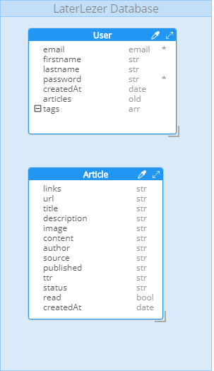

# Software Guidebook

Aangezien het lezen van de code van de LaterLezer niet het hele verhaal verteld en de redenatie achter het design van LaterLezen niet in code te beschrijven is, is ervoor gekozen om een software guidebook te schrijven. Dit maakt het gemakkelijk voor de programmeurs die verder willen bouwen op de bestaande applicatie. In dit software guidebook staat dan ook beschreven hoe de LaterLezer applicatie in elkaar steekt. 

## Table of Contents
[TOC]

## Context

De opdrachtgever is als onderzoeker bij ons langsgekomen met de vraag of wij een reader-app voor hem willen ontwikkelen. De bestaande reader-apps voldoen niet aan de eisen die hij stelt. Hij denkt dat het waard is om een nieuwe reader-app te laten maken die wel aan zijn eisen voldoen. De eisen zijn beschreven in de hoofdstuk Functioneel Overzicht. Deze reader-app is bedoeld om hem en andere onderzoekers te ondersteunen met het opslaan van wetenschappelijke artikelen zodat zij deze later kunnen lezen.

Met deze reader-app hoopt de opdrachtgever dat deze app wel aan zijn eisen voldoet, en dat andere onderzoekers naar deze reader-app overstappen. Dit betekent dat de Laterlezer een concurrent wordt voor de andere reader-apps, zoals Instapaper, Raindrop, Pocket.io, etc. De oprachtgever heeft als doel om een reader-app te ontwikkelen die meer gebruikersvriendelijk is voor lezers die frequent (wetenschappelijke) artikelen opslaan, dus Laterlezer is bedoeld voor een ander doelgroep dan de hiervoor genoemde reader-apps.

## Functioneel Overzicht

De Laterlezer app bestaat uit een mobiele webapplicatie waarin de gebruiker zijn artikelen op kan slaan en kan lezen. Daarnaast bestaat Laterlezer uit een extensie, waarmee gebruikers artikelen snel op kan slaan op een andere website.

De Laterlezer app slaat (wetenschappelijke) artikelen op die vanuit andere websites zijn gehaald. Elk artikel heeft een URL waarvan de artikel vandaan komt, en optioneel een aantal tags om het artikel snel terug te vinden m.b.v. het filtersysteem voor tags. Bij het lezen van een artikel kan de gebruiker een aantal functies gebruiken om het lezen makkelijker te maken, bijvoorbeeld het groter maken van tekst, of het veranderen van de achtergrond kleur. Om een artikel bij een gebruiker, moet deze natuurlijk ook kunnen registreren en inloggen. 

Zonder deze basisfunctionaliteit kan de applicatie niet werken. Het is van belang dat deze functies als eerst zijn uitgevoerd voordat we verder kunnen met de extra functies. De opdrachtgever wilt dat wij een aantal extra functionaliteiten implementeren zodat de app daadwerkelijk zijn eigen functies heeft. Deze functionaliteiten zijn als volgt:

- Pay-walls omzeilen
- Hiërarchische tags
- Opslaan van PDF's
- Metadata ophalen
- Importeer data van andere reader-apps
- Ondersteuning grotere teksten

Voor meer verduidelijking over deze functionaliteiten wordt het Plan van Aanpak geraadpleegd. Welke functionaliteiten wij implementeren, hangt af van wat de opdrachtgever wilt en hoeveel tijd wij ervoor nodig hebben om dat te realiseren. 

Met deze extra functionaliteiten hopen wij onze doelgroep, de onderzoekers, tevreden zijn met onze reader-app, en hierdoor artikelen makkelijker kunnen opslaan en lezen vergeleken met de andere reader-apps.

## Kwaliteitsattributen
Natuurlijk zijn er tijdens de ontwikkeling van een app ook niet functionele eisen, deze worden ook wel de kwaliteitsattributen genoemd. Om te zorgen dat onze reader-app in de toekomst nog steeds onderhoudbaar blijft, moet de app voldoen aan een aantal kwaliteitsattributen. Deze attributen zijn als volgt:

- Prestatie: om de app te laten draaien moeten de servers van de app voortdurend online zijn. Hierdoor kunnen gebruikers altijd nieuwe artikelen opslaan en hun eigen artikelen ophalen. 

- Beveiliging: natuurlijk moeten de gegevens van de gebruiker beveiligd zijn opgeslagen in de database van de app. Daarom versleutelen we gegevens zoals de wachtwoorden, als er toch ooit iemand onbevoegd toegang krijgt tot de database, kunnen ze niet bij de daadwerkelijke wachtwoorden van onze gebruikers komen.

  Daarnaast willen wij ten alle koste inbraken zoals SQL Injectie voorkomen, dit doen we door middel van meerdere RegEx controles uitvoeren voordat de invoer verstuurd naar de server. Behalve de Front-end bevat de Back-end ook een aantal controles.

- Compatibiliteit: de LaterLezer app wordt uiteindelijk ook een web-extensie. Daarom moet deze extensie beschikbaar zijn voor alle browsers. Hiernaast willen wij het ook mogelijk maken dat alle artikelen toegevoegd kunnen worden bij onze app.

- Gebruikersvriendelijkheid: om alle gebruikers tevreden te houden moet de app gebruikersvriendelijk zijn. Dit doen met een menu waarin je jouw voorkeur kan aangeven tijdens het lezen van een artikel. Denk hierbij aan de achtergrond kleur, het lettertype en lettergrootte. Daarnaast zullen de gebruikers een mogelijkheid hebben om een van de vaste thema's te kiezen die LaterLezen aanbied.
- Efficiëntie: natuurlijk wilt een gebruiker niet teveel tijd en moeite insteken tijdens het toevoegen van een artikel. Daarom houdt LaterLezen het erg compact en makkelijk. De gebruiker hoeft eenvoudig een URL van het artikel in te voeren en eventueel een of meerdere tags.

Aan de hand van deze kwaliteitsattributen hoopt de opdrachtgever een reader-app te kunnen ontwikkelen die uitstraalt vergeleken met de andere reader-apps

## Beperkingen

Tijdens het ontwikkelen van de app zijn er een aantal beperkingen, deze beperkingen worden hieronder genoemd:

- Het team heeft 3 sprints om aan Laterlezer te werken. (1 sprint is 2 weken)
- Het team bestaat uit 5 man.
- Ieder teamlid werkt tijdens het project ook aan zijn leerdoelen.
- Het team ontwikkelt de app d.m.v. Node, Express, MongoDB/Mongoose en React omdat het team daarmee de meeste kennis heeft.
- Het team maakt gebruik van onbekende technieken, zoals ontwikkeling van extensies en login met oAuth
- De server stuurt en ontvangt berichten van de client in de vorm van JSON

Een beperkingen hoeft niet altijd meteen negatief te zijn, kijk hierbij naar de grootte van ons team, met een klein groepje van 5 is het makkelijker om samen te werken en het overzicht van het gehele team te behouden. Ook is het hierdoor simpeler om gebruik te maken van elkaars sterke punten.

## Principes
Wij hebben op dit moment niet over bepaalde principes nagedacht tijdens het ontwerpen en het bouwen van de Laterlezer app.

## Software-architectuur
Door het lezen van dit hoofdstuk krijg je een beter beeld van hoe de structuur van de software eruit ziet. Deze schetsen zijn gebaseerd op het C4 model.

1. The big picture (system context)

    Dit is het beginpunt van onze applicatie, hierbij wordt de interactie tussen de gebruiker en de reader-app weergeven.

    

    

    

2. Container view

    Dit is een verdiepende schets van wat er nou precies afspeelt wanneer de gebruiker een actie uitvoert.

    

    

    

3. Component views

    Hierna kunnen we vergroten tot de component view per container. Deze worden opgedeeld in de API component, app component en extension component.

    ### API component view
    

    ### Extension view
    

    ### Database view
    

    ### LaterLezer web app component
    

    ### LaterLezer app view
    

    De gebruiker komt voor het eerst op de homepagina van de website. De gebruiker kan ervoor kiezen om te registreren, waarin hij in de registratiepagina komt, of om in te loggen. De gebruiker komt dan op de pagina waarin hij kan inloggen. 

    De gebruiker zal als eerst registreren op de website, omdat de gebruiker geen account heeft. Nadat de gebruiker de registratieformulier heeft ingevuld, stuurt het registersysteem een functie aan van servercommunication. Servercommunication voert dan de functie aan die het registersysteem aanroept, en doet een fetch request naar de API toe. Voor het registersysteem is het een POST request naar de user route in de API. De API handelt het verzoek in de relevante route af. Eerst controleert de API of de email formaat correct is en of de wachtwoord lang genoeg is. Daarna voegt de API na het hashen van de wachtwoord de gebruiker in de database toe. De API stuurt een bericht terug naar de web applicatie. Het registersysteem vangt dit keer het bericht op, en verstuurt de gebruiker naar de dashboard.

    De gebruiker bevindt zich nu in de dashboard. De gebruiker kan nu alleen een artikel opslaan, omdat de gebruiker voor het eerst op de dashboard komt. De gebruiker navigeert naar de save article pagina. Daarin geeft de gebruiker de URL van de artikel mee om een artikel op te slaan. Optioneel kan de gebruiker ook een titel meegeven, die dan de originele titel van de artikel overschrijft. De gebruiker kan ook tags meegeven, zodat de gebruiker de artikel makkelijker terug kan vinden op de search article component. Zodra de gebruiker de artikel opslaat, stuurt de save article component een functie aan van Servercommunication, die vervolgens een fetch request doet naar de API. De API gaat naar de route toe die de fetch request heeft aangegeven, en handelt het verzoek om een article op te slaan daarin af. Na het afhandelen van het verzoek stuurt de API een bericht terug naar de Save article component om te laten weten dat het opslaan van de artikel is gelukt, of gefaald is. De save article component redirect de gebruiker niet naar een ander pagina.

    Nu kan de gebruiker kiezen om terug te gaan naar de dashboard, om een artikel te zoeken, of om nog een artikel op te slaan door het hierboven beschreven proces opnieuw te herhalen. Als de gebruiker de opgeslagen artikel wilt lezen, navigeert de gebruiker terug naar de dashboard. De dashboard laat nu de opgeslagen artikel zien. De gebruiker kan de artikel lezen door op de titel, afbeelding of de "Read article" knop aan te klikken. 
    
    De gebruiker komt nu bij de Display article component. Daarin kan de gebruiker de gekozen artikel doorlezen. Als eerst roept display article de functie via servercommunication aan om de huidige geselecteerde thema op te halen. Bij een nieuw gebruiker is de thema altijd 'White'. De display article component zet na het ophalen van de kleur de thema in. De gebruiker kan in de component een nieuw thema selecteren. Als een gebruiker een thema selecteert, dan kan de gebruiker de geselecteerde thema bekijken. De gebruiker kan ervoor kiezen om de thema op te slaan, een ander thema te selecteren, of het kiezen van een thema te annuleren. Bij het selecteren van een thema doet de display article component nog geen verzoek naar de API. Op het moment dat de gebruiker niet zijn thema wilt wijzigen door op annuleren te klikken, of buiten de themaopties menu te klikken, doet de display article component nog een request naar de API om de huidige opgeslagen kleur op te halen, en deze opnieuw in te stellen aan de component. Als de gebruiker een nieuw thema selecteert en opslaat door op opslaan te klikken, dan roept de display article component een functie in servercommunication aan, die vervolgens de fetch request naar de API doet om de nieuwe kleur te zetten. Zodra de API een bericht terug stuurt naar de display article component, stelt dit component het nieuwe thema in, zodat de gebruiker een nieuwe thema krijgt om de artikel te lezen.

    Naast het instellen van de thema kan de gebruiker ook naar de pagina van de originele artikel navigeren waar de gebruiker de artikel vandaan heeft gehaald. Er is op dat moment naast de vorige knop in de browser of het handmatig invoeren van de website URL geen manier om terug te gaan naar de display artikel component.

    De gebruiker kan na het lezen van de artikel ervoor kiezen om terug naar de dashboard te gaan, een nieuwe artikel op te slaan, of het zoeken van opgeslagen artikelen. Als de gebruiker zijn artikelen wilt zoeken, navigeert de gebruiker naar de search article component. Hierin heeft de gebruiker de optie om opgeslagen artikelen op tags, of op auteursnaam te zoeken. 
    
    //TODO: zoeken op tags uitbreiden.
    Als een gebruiker ervoor kiest om een artikel te zoeken op basis van tags, dan haalt de search article component alle bestaande tags op. De gebruiker kan een tag aanvinken door middel van een checkbox. Door op de "Search" button te klikken wordt er een functie aangeroepen in Servercommunication. De functie in Servercommunication doet vervolgens een fetch request naar artikelen die matchen met de aangevinkte tag(s). Na het verzoek van de search article component krijgt dit component de relevante artikelen terug van de API. De resultaten worden overzichtelijk getoond in een lijstweergave met kaarten.

    Als de gebruiker ervoor kiest om een artikel op basis van auteursnaam te zoeken, dan haalt de search article component alle namen van bestaande auteurs op. Alle artikelen die geen auteur hebben, worden weggefiltert voor de autocomplete zoeklijst. Er wordt gebruik gemaakt van een autocomplete module van Materialize, die ervoor zorgt dat de naam van een auteur automatisch aanvult als er een deel van de auteursnaam is ingevuld. De API ondersteunt ook de mogelijkheid om op een deel van de auteursnaam kan zoeken. Op deze manier wordt er ook gezocht op een gedeelte van de naam bij een auteur. Dan typt de gebruiker de naam van de auteur in. Na het invullen van de auteursnaam, zoekt de gebruiker op de artikelen die door die specifieke auteur is uitgebracht. De search article component roept weer de functie in Servercommunication aan, die vervolgens een fetch request naar de API doet om de artikelen die uitgebracht zijn door de ingevulde auteur op te halen. Na het verzoek van de search article component, krijgt dit component de relevante artikelen terug van de API. De resultaten worden overzichtelijk getoond in een lijstweergave met kaarten.

## Infrastructuur-architectuur
(beantwoord de vragen in het software guidebook)
## Deployment
(beantwoord de vragen in het software guidebook)
## Werking en ondersteuning
//TODO: Installatie van de applicatie. back-end, front-end en de extensie beschrijven.
